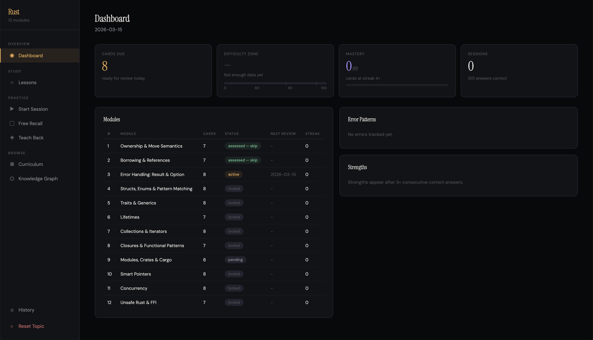
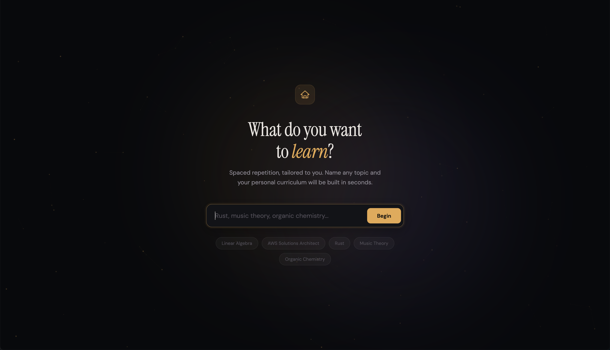
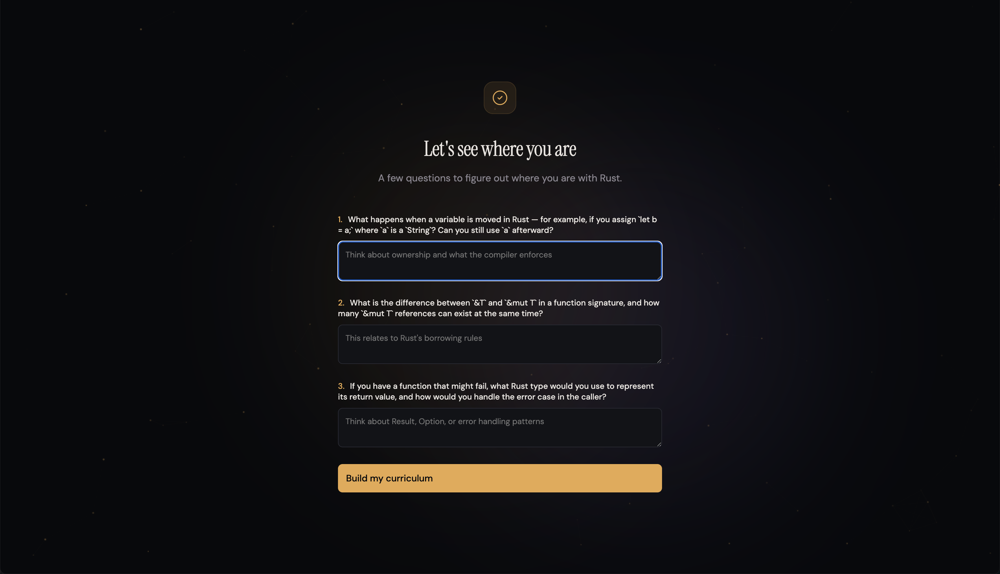
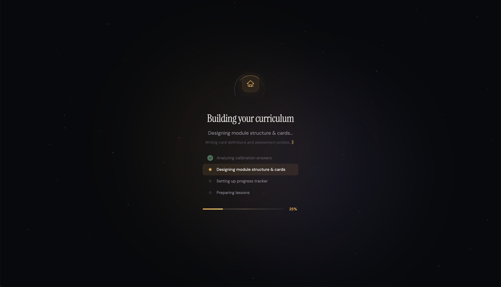
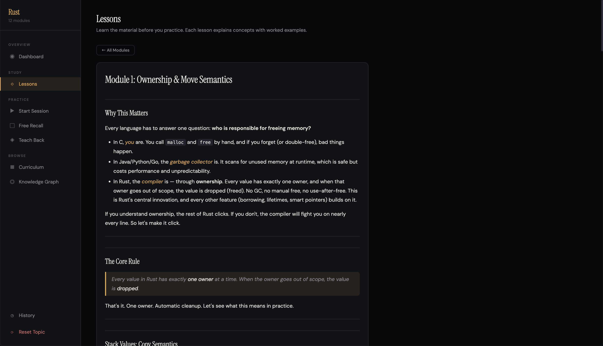
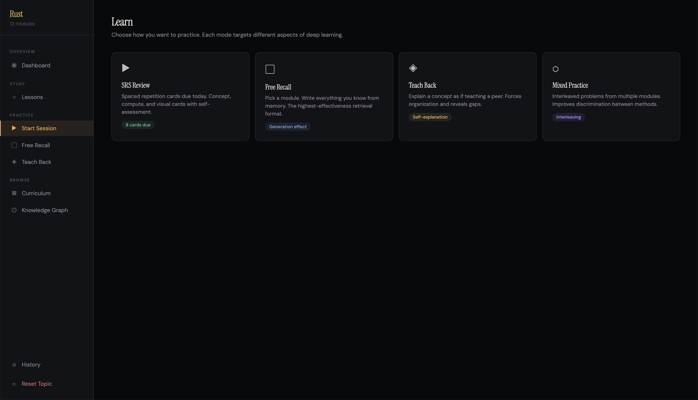
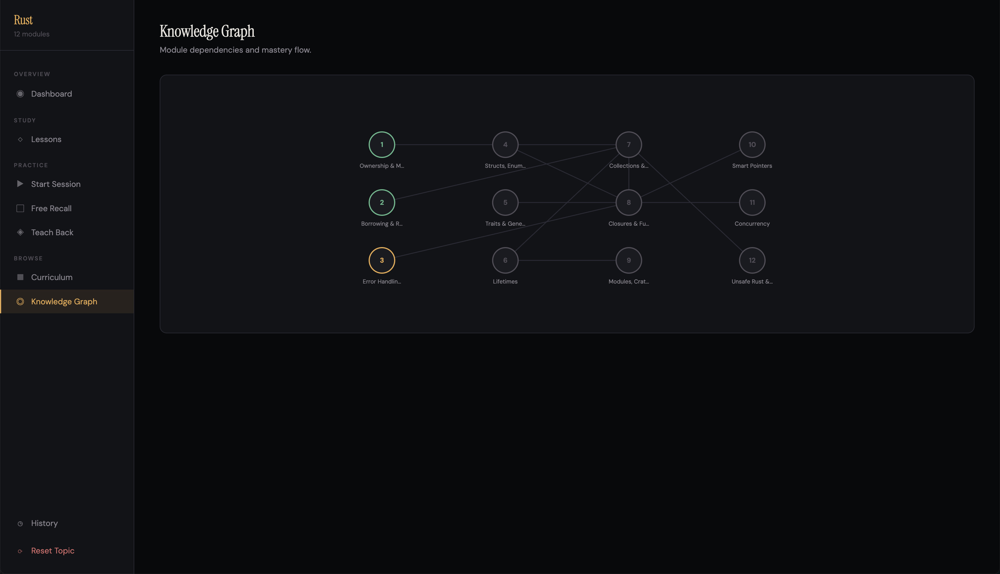

# Learn — AI-Powered Personal Tutor

An AI tutor that builds personalized spaced repetition curricula from any topic. Tell it what you want to learn, answer a few calibration questions, and get a full course with lessons, flashcards, and multiple practice modes — all running locally in your browser.

Powered by Claude Code as a backend. No databases, no accounts, no cloud — just markdown files and a Python server.



## One-Line Setup

```bash
python3 server.py && open http://localhost:3000
```

### Prerequisites

- **Python 3** (no pip packages needed for the server)
- **[Claude Code CLI](https://docs.anthropic.com/en/docs/claude-code)** installed and authenticated (`claude` in your PATH)
- **matplotlib + numpy + scipy** for visual cards: `pip install matplotlib numpy scipy`

## How It Works

### 1. Pick a topic

Enter anything — a programming language, a certification exam, music theory, organic chemistry. The app shows example topics to get you started.



### 2. Answer calibration questions

Claude generates 2-3 topic-specific probes to gauge your current level. These aren't generic "rate yourself" questions — they test actual knowledge.



### 3. Curriculum builds automatically

Based on your answers, Claude generates a full tiered curriculum (8-20 modules), a progress tracker, and a detailed lesson for every module. A progress bar tracks each step.



### 4. Study the lessons

Each module has a lesson written in a tutor's voice — concepts, worked examples, comparison tables, common pitfalls. Read these before practicing.



### 5. Practice with multiple modes

Four evidence-based practice formats, each targeting a different aspect of deep learning:

- **SRS Review** — Spaced repetition cards (concept, compute, and visual types) with self-grading and error classification
- **Free Recall** — Pick a module, write everything you know from memory, compare against reference
- **Teach Back** — Explain a concept as if teaching someone, then compare
- **Mixed Practice** — Interleaved problems across modules



### 6. Track your progress

The dashboard shows cards due, mastery percentage, difficulty zone (targeting the 60-90% sweet spot), and module status. Error patterns and strengths are tracked across sessions.

### 7. Visualize dependencies

The knowledge graph shows module prerequisites and mastery flow at a glance.



## Project Structure

```
server.py          # Local HTTP server + Claude CLI integration
index.html         # Single-page web app (no build step)
CLAUDE.md          # AI instructions for curriculum generation
LEARNING_THEORY.md # Cognitive science foundations

# Generated per-topic (gitignored):
CURRICULUM.md      # Module definitions, cards, prerequisite graph
PROGRESS.md        # SRS scheduling, card history, session stats
LEARNER_PROFILE.md # Error tendencies, strengths (created after session 1)
lessons/           # One markdown lesson per module
visuals/           # Generated matplotlib scripts + PNG outputs
```

## Usage

```bash
# Start the server (auto-finds next port if 3000 is busy)
python3 server.py

# Or specify a port
python3 server.py 8080

# Or point to a specific Claude CLI binary
python3 server.py --claude-path /usr/local/bin/claude
```

Open `http://localhost:3000` in your browser. Everything else happens in the UI.

## Resetting

Click **Reset Topic** in the sidebar, or hit the API directly:

```bash
curl -X POST http://localhost:3000/api/reset
```

This clears all generated files and lets you start fresh with a new topic.

## Design Principles

Built on established cognitive science (documented in `LEARNING_THEORY.md`):

- **Desirable difficulties** — spacing, interleaving, generation, testing (Bjork & Bjork)
- **Expertise reversal** — worked examples for novices, retrieval practice for intermediates (Van Gog et al.)
- **Self-explanation effect** — Teach Back mode forces articulation (Chi et al.)
- **Error classification** — every mistake gets typed and tracked, building verification reflexes
- **Generation effect** — all exercises require producing, never just recognizing

## Acknowledgements

Inspired by [SRS by Voxos](https://srs.voxos.ai/) and [Project Second Brain](https://layerbylayer.ai/posts/2026_02_11_project_second_brain/) by Layer by Layer.
